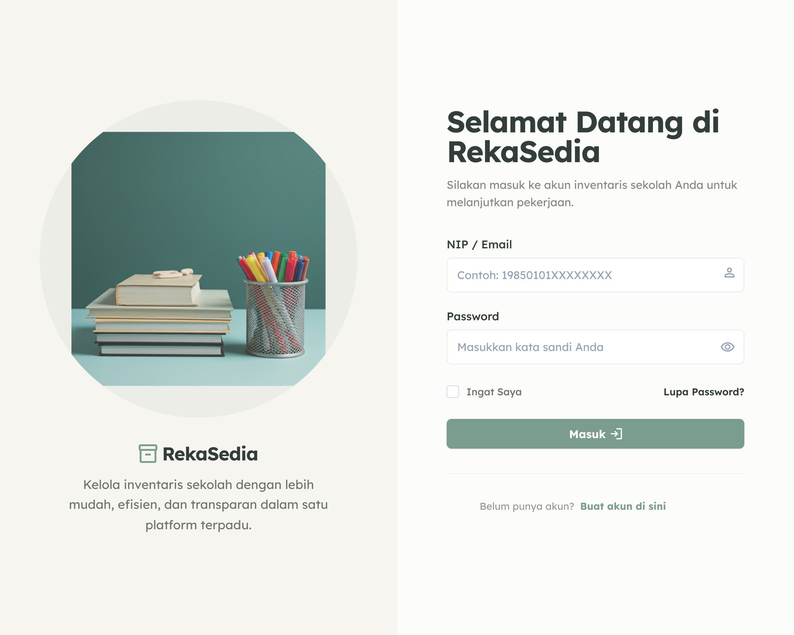
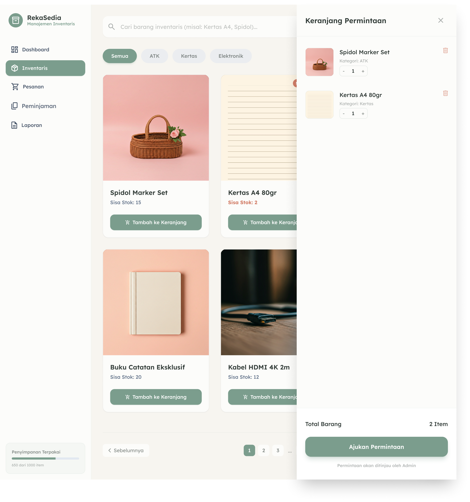

# RekaSedia

RekaSedia adalah aplikasi inventaris sekolah untuk membantu admin Sarpras dan guru mengelola kebutuhan barang harian: mulai dari melihat stok, mengajukan permintaan, memvalidasi permintaan, sampai memantau peminjaman aset.

Project ini sedang difokuskan untuk kebutuhan demo dan testing dengan data dummy. Jadi aplikasi bisa langsung dicoba tanpa setup database atau backend dulu.

## Tampilan Aplikasi

Beberapa tampilan berikut dipilih karena mewakili alur utama RekaSedia: user masuk, guru mengajukan barang, lalu admin memantau dan memproses permintaan.

### Login

Halaman awal untuk masuk sebagai admin atau guru. Di mode dummy, login bisa memakai alias `admin` atau `guru`.



### Dashboard Admin

Admin bisa melihat kondisi inventaris secara cepat: permintaan terbaru, stok kritis, dan ringkasan aktivitas.


### Katalog Guru dan Keranjang

Guru memilih barang dari katalog, memasukkannya ke keranjang, lalu mengirim permintaan untuk divalidasi admin.



### Status Pesanan Guru

Setelah permintaan dikirim, guru bisa memantau apakah pesanan masih menunggu validasi, disetujui, atau ditolak.


## Yang Bisa Dicoba

Ada dua peran utama di aplikasi ini:

| Peran | Fungsi utama |
| --- | --- |
| Admin | Melihat ringkasan dashboard, mengelola inventaris, menyetujui atau menolak permintaan guru, dan melihat laporan. |
| Guru | Melihat katalog barang, memasukkan barang ke keranjang, mengirim permintaan, melihat status pesanan, dan memantau peminjaman. |

Alur dummy-nya sudah saling terhubung:

- Guru membuat permintaan dari katalog.
- Permintaan muncul di dashboard dan halaman validasi admin.
- Admin menyetujui atau menolak permintaan.
- Kalau disetujui, stok barang dummy ikut berkurang.
- Dashboard admin dan guru membaca data dummy yang sama selama sesi browser masih aktif.

## Mode Data Dummy

Saat ini aplikasi berjalan dalam mock mode lewat `src/services/api.ts`.

Data awalnya berasal dari:

```text
src/data/mockData.ts
```

Perubahan saat testing disimpan sementara di `sessionStorage`, bukan database. Artinya:

- Selama tab browser masih aktif, perubahan tetap tersimpan.
- Kalau tab/browser ditutup lalu dibuka lagi, data kembali ke dummy default.
- Tidak perlu clear database atau seed ulang setiap kali demo.

Ini sengaja dibuat begitu supaya testing terasa ringan dan gampang diulang.

## Akun Demo

Di mock mode, password bebas. Yang penting pakai email atau alias berikut:

| Login | Masuk sebagai |
| --- | --- |
| `admin` | Admin Sarpras |
| `guru` | Guru |
| `admin@rekasedia.sch.id` | Admin Sarpras |
| `sarah.putri@rekasedia.sch.id` | Guru |

## Cara Menjalankan

Pastikan sudah ada Node.js dan npm.

```bash
npm install
npm run dev
```

Buka aplikasi di:

```text
http://localhost:5173
```

Untuk memastikan build production aman:

```bash
npm run build
```

## Tech Stack

| Bagian | Teknologi |
| --- | --- |
| Frontend | React 19 + TypeScript |
| Build tool | Vite |
| Routing | React Router |
| Chart | Chart.js + react-chartjs-2 |
| Styling | CSS Modules + CSS variables |
| Icons | Font Awesome |

## Struktur Singkat

```text
src/
  components/        Komponen UI reusable
  data/              Data dummy untuk demo
  pages/
    admin/           Halaman dashboard admin
    teacher/         Halaman dashboard guru
  services/          Mock API dan API wrapper
  styles/            CSS Modules dan design tokens
  utils/             Helper kecil, termasuk gambar item otomatis
```

File penting:

| File | Fungsi |
| --- | --- |
| `src/services/api.ts` | Pusat mock API. Di sini data dummy dibaca, diubah, dan disimpan sementara ke session. |
| `src/data/mockData.ts` | Seed data awal untuk user, item, request, loan, dan report. |
| `src/utils/itemImages.ts` | Generator gambar item berdasarkan nama barang. |
| `src/App.tsx` | Konfigurasi route utama. |

## Alur Demo yang Disarankan

1. Login sebagai `guru`.
2. Buka katalog inventaris.
3. Tambahkan beberapa barang ke keranjang dan ajukan permintaan.
4. Logout, lalu login sebagai `admin`.
5. Buka dashboard atau menu permintaan.
6. Setujui salah satu permintaan.
7. Cek stok di inventaris admin atau katalog guru.

Dengan alur ini, hubungan antar data dummy kelihatan jelas tanpa perlu backend.

## Catatan Backend

Folder `server/` dan file SQL masih ada untuk arah integrasi backend, tapi versi demo saat ini tidak bergantung ke backend. Kalau nanti ingin kembali ke API sungguhan, mock mode di `src/services/api.ts` bisa dimatikan dan endpoint backend bisa dipakai lagi.

## Status

Yang sudah ada:

- Login dan register UI.
- Dashboard admin dan guru.
- Katalog inventaris dengan gambar item otomatis.
- Keranjang permintaan guru.
- Validasi permintaan oleh admin.
- Data dummy yang terhubung antar halaman.
- Penyimpanan dummy sementara per sesi browser.

Yang bisa dikembangkan berikutnya:

- Integrasi database penuh.
- Upload gambar barang asli.
- Export laporan.
- Notifikasi untuk perubahan status permintaan.
- Hak akses dan validasi backend yang lebih lengkap.

## Lisensi

Project ini dibuat untuk kebutuhan akademis dan demo pengembangan aplikasi inventaris sekolah.
